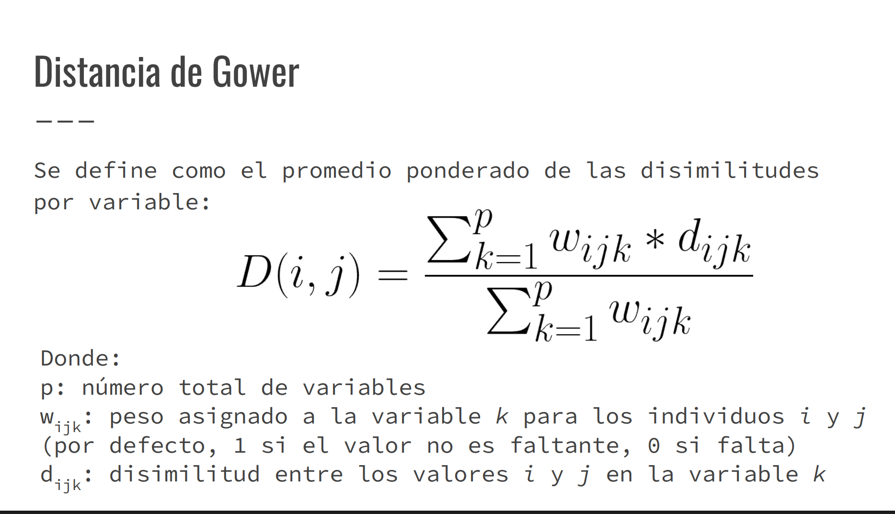

## Ejercicio 2 - tareas

Hacer en scriptBorrador2

## Distancia de Gower

1) Implementar la formula de Gower
2) Validar con un subconjunto pequeño (ej:  5/6 filas)
3) Probar el calculo de la matriz de distancias en una muestra pequeña del dataset.

*Observaciones:* Gower permite tratar datos nulos, variables cuantitativas y cualitativas

## Teoría 
### Qué hace? 
Mide la distancia entre dos observaciones cuando tus datos tienen mezcla de tipos: numéricos, categóricos, ordinales y binarios. La distancia total es el promedio ponderado de las disimilitudes (distancias) de cada variable.

### Rango
devuelve un valor en [0,1] (0 = iguales, 1 = totalmente distintos). La similitud de Gower suele definirse como 1−distancia.

### Cómo calcula cada variable? 

* *Numéricas:* 
En el caso de las variables numéricas, la distancia de Gower calcula la disimilitud entre dos valores como la diferencia absoluta entre ellos, dividida por el rango de la variable (max−min). Esto equivale a una normalización min–max automática, que lleva cada variable al rango [0,1], evitando que una variable con valores grandes (por ejemplo, “ingresos”) domine sobre otra con valores pequeños (como “edad”) 

En otras palabras, Gower compara cuánto difieren los valores relativamente dentro del rango posible de esa variable. Por eso, no hace falta aplicar un StandardScaler (que centra en media 0 y varianza 1), ya que este no mantiene el rango acotado en [0,1]; lo adecuado es dejar que Gower use su propia normalización por rango para todas las variables numéricas.

* *Categóricas nominales:* Cuando una variable es categórica nominal, no tiene orden entre sus categorías (por ejemplo, color = rojo, verde, azul). En este caso, Gower calcula la disimilitud simplemente como:
- 0 si los valores son iguales,
- 1 si son distintos.

Es decir, no hace falta aplicar una transformación numérica continua ni una escala —solo asegurar que estén codificadas de forma categórica o con one-hot encoding, para que el algoritmo reconozca cada categoría como independiente.

* *Ordinales:* primero se mapean a [0,1] respetando el orden y luego se tratan como numéricas; si no se normalizan, se desbalancea su contribución. 

#### Observación sobre las variables ordinales
Las variables ordinales deben codificarse mediante Label Encoding, asignando valores numéricos que respeten el orden natural de sus categorías (por ejemplo, bajo = 1, medio = 2, alto = 3). Luego, esos valores deben normalizarse con la fórmula (x−min)/(max−min) para llevarlos al rango [0,1], de modo que su aporte a la distancia de Gower sea proporcional al de las demás variables. 
No se recomienda usar StandardScaler porque este transforma los datos según media y desviación estándar (centrando en 0 y escalando a varianza 1), lo cual no garantiza mantener el rango [0,1] requerido por Gower; por eso, la normalización min–max es la opción más adecuada.

* *Binarias:*
    - Simétricas: el 0 y el 1 tienen la misma importancia.
        * *Ejemplo:* sexo (hombre=0, mujer=1) o fuma/no fuma. En este caso, Gower considera que dos ceros son tan parecidos como dos unos, y calcula la disimilitud como:
            - 0 si son iguales (0-0 o 1-1)
            - 1 si son distintos (0-1 o 1-0)

    - Asimétricas: el valor 1 representa una presencia o evento relevante, y el 0 solo indica ausencia (sin información).
        * *Ejemplo:* tiene enfermedad (1=sí, 0=no) o ha comprado (1=sí, 0=no).
            En este caso, se ignora el par (0,0), porque coincidir en la ausencia no aporta similitud; lo importante es coincidir en la presencia (1)

* *Faltantes y pesos:* cada variable puede llevar peso (por defecto 1) y si un dato falta, su peso se pone en 0 para ese par al promediar. 
    * Cuándo usarla: ideal para clustering con datos mixtos (p. ej., Agglomerative/average linkage, k-medoids) y para matrices de distancias en análisis exploratorio. 

* *Buenas prácticas:*
- Mantener numéricas escaladas por rango (ya lo hace Gower).
- Ordinales → normalizarlas a [0,1].
- Evitar codificar nominales como 1,2,3 (induce falsos órdenes)

## Pasos a seguir:

### 1) Variables que no vamos a usar

* fweigth 

* *education_num* -> porque termina representando lo mismo que la variable *education* ya que la normalizamos con label_encoding y terminariamos teniendo duplicados.

* *income* -> En un análisis de clustering (no supervisado) esa variable no se usa como entrada porque estarías forzando el algoritmo a agrupar usando la respuesta final, lo cual rompe la idea de descubrir patrones.

### 2) Normalizamos las variables

#### a)*age*

Hay que normalizar con la formula de max-min.

#### b) *workclass*

La variable workclass es categórica nominal, ya que describe el tipo de empleo o relación laboral (por ejemplo, Private, Self-emp-not-inc, Federal-gov, Without-pay, etc.) sin que exista un orden lógico entre ellas. En la distancia de Gower no se normaliza ni se codifica numéricamente, sino que se compara por igualdad o diferencia: si dos observaciones pertenecen al mismo tipo de empleo, la distancia en esta variable es 0; si pertenecen a clases laborales distintas, la distancia es 1.

#### c) *education*

Este es ordinal - Label encoging

    | Nivel educativo | Código | Normalizado |
    | --------------- | ------ | ----------- |
    | Preschool       | 1      | 0.00        |
    | 1st-4th         | 2      | 0.07        |
    | 5th-6th         | 3      | 0.13        |
    | 7th-8th         | 4      | 0.20        |
    | 9th             | 5      | 0.27        |
    | 10th            | 6      | 0.33        |
    | 11th            | 7      | 0.40        |
    | 12th            | 8      | 0.47        |
    | HS-grad         | 9      | 0.53        |
    | Some-college    | 10     | 0.60        |
    | Assoc-voc       | 11     | 0.67        |
    | Assoc-acdm      | 12     | 0.73        |
    | Bachelors       | 13     | 0.80        |
    | Masters         | 14     | 0.87        |
    | Prof-school     | 15     | 0.93        |
    | Doctorate       | 16     | 1.00        |

#### d) *marital-status*
La variable marital-status presenta las categorías Married-civ-spouse, Divorced, Never-married, Separated, Widowed, Married-spouse-absent y Married-AF-spouse. Dado que estos valores no tienen un orden jerárquico ni numérico, se considera una variable categórica nominal. En el cálculo de la distancia de Gower, no se normaliza ni se codifica numéricamente, sino que se compara por igualdad o diferencia: si dos observaciones comparten el mismo estado civil, la distancia en esta variable es 0; si difieren, es 1.

#### e) *occupation*

La variable occupation es de tipo categórica nominal, ya que representa diferentes ocupaciones sin un orden natural entre ellas. Por lo tanto, para el cálculo de la distancia de Gower no se normaliza ni se codifica numéricamente, sino que se compara por igualdad o diferencia. Es decir, si dos observaciones tienen la misma ocupación, la distancia en ese atributo es 0, y si son diferentes, la distancia es 1. De esta manera, occupation aporta una medida de similitud binaria que se promedia junto con el resto de las variables en la distancia total de Gower

#### f) *relationship*

La variable relationship incluye las categorías Wife, Own-child, Husband, Not-in-family, Other-relative y Unmarried. Estas categorías describen el tipo de relación familiar o de parentesco, pero no existe un orden lógico o jerárquico entre ellas, por lo que se trata de una variable categórica nominal. En la distancia de Gower, se compara únicamente por igualdad o diferencia: si dos observaciones tienen la misma categoría, la distancia en este atributo es 0; si difieren, es 1.

#### g) *race*

La variable race contiene las categorías White, Asian-Pac-Islander, Amer-Indian-Eskimo, Other y Black. Estas categorías identifican distintos grupos étnicos sin un orden jerárquico o numérico, por lo que se clasifican como categóricas nominales. En el cálculo de la distancia de Gower, esta variable no se normaliza ni se codifica numéricamente, sino que se compara por igualdad o diferencia: si dos individuos pertenecen al mismo grupo étnico, la distancia en esta variable es 0; si pertenecen a grupos distintos, es 1.

#### h) *sex*

La variable sex es binaria simétrica, ya que sus dos categorías (Male/Female) tienen el mismo peso y significado. En la distancia de Gower se considera 0 si son iguales (0–0 o 1–1) y 1 si son diferentes (0–1 o 1–0).

#### i) *capital-gain*

La variable capital-gain es cuantitativa continua, ya que representa montos numéricos de ganancia de capital. En la distancia de Gower se normaliza mediante el método min–max, dividiendo la diferencia absoluta entre dos observaciones por el rango total de la variable. De esta forma, cada valor se lleva al rango [0,1] y se evita que su escala influya más que la de otras variables.

#### j) *capital-loss*

La variable capital-loss es cuantitativa continua, ya que representa montos numéricos de ganancia de capital. En la distancia de Gower se normaliza mediante el método min–max, dividiendo la diferencia absoluta entre dos observaciones por el rango total de la variable. De esta forma, cada valor se lleva al rango [0,1] y se evita que su escala influya más que la de otras variables.

#### k) *hours-per-week*

La variable hours-per-week es cuantitativa continua, ya que representa montos numéricos de ganancia de capital. En la distancia de Gower se normaliza mediante el método min–max, dividiendo la diferencia absoluta entre dos observaciones por el rango total de la variable. De esta forma, cada valor se lleva al rango [0,1] y se evita que su escala influya más que la de otras variables.

#### l) *native-country*

La variable native-country es categórica nominal, ya que identifica el país de origen de cada individuo (por ejemplo, United-States, Mexico, India, Germany, etc.) y no posee un orden jerárquico entre sus categorías. En la distancia de Gower, esta variable no se normaliza ni se codifica numéricamente, sino que se compara por igualdad o diferencia: si dos observaciones tienen el mismo país de origen, la distancia en este atributo es 0; si provienen de países distintos, la distancia es 1.

### 3) calcular la formula de Gower (a mano, no usar librerias)

En esta foto esta la formula, hay que usarla con todos los datos normalizados en 2)

### 4) Validar con un subconjunto pequeño

*Tal como pide la consigna:*

* Elegí 5 o 6 filas variadas (distintas ocupaciones, sexos, edades, etc.).
* Calculá manualmente 2 o 3 distancias para verificar que los valores tengan sentido:
    * Casos muy parecidos deben dar distancia baja (~0).
    * Casos muy distintos, distancia alta (~1).
* Faltantes deben ser ignorados sin romper el cálculo.
* Esto te sirve para verificar que tus transformaciones y normalizaciones fueron correctas.

### 5) Calcular la matriz de distancias en una muestra más grande

* Usá unas 50 a 200 filas del dataset para no saturar la memoria.
* Aplicá el cálculo de Gower a todo ese subconjunto.
* Verificá que la matriz sea:
    - simétrica
    - sin valores negativos
    - con distancias entre 0 y 1.

* Podés además observar la distribución de las distancias (por ejemplo, histograma) para ver si hay casos muy parecidos (distancias cercanas a 0) o muy diferentes (cercanas a 1).